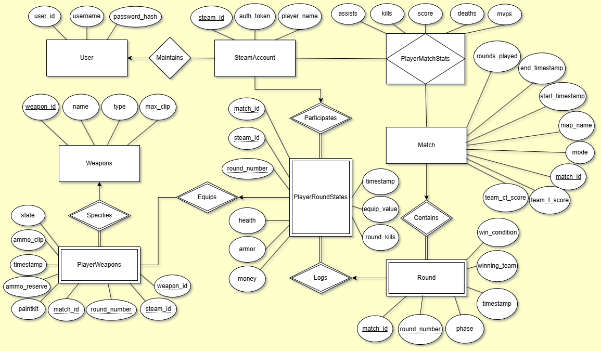

# counterTrak
## Introduction

A project developed for the course _COP4710 Theory and Structure of Databases_. The goal of this semester-long project is to design and implement a web-based informatics application powered by a relational database management system (**RDBMS**). We have chosen PostgreSQL (**PSQL**) as our specific RDBMS service, powered by our own custom Python backend system. 

This application, `counterTrak`, is intended to act as a lightweight performance statistics tracker for players of Valve Corporation's highly-popular first-person-shooter title _Counter Strike 2_ (**CS2**), released September 27, 2023. Data collection is fulfilled through the utilization of CS2's native Game State Integration (**GSI**) system, developed and maintained by Valve. CS2 GSI is the optimal approach for this project's scope, as it enables developers to collect relevant game-state metadata contained in JavaScript Object Notation (**JSON**) files transmitted to a specified Hyper-Text Transfer Protocol (**HTTP**) POST endpoint. These HTTP POST requests are relayed regularly, and their frequency may be configured relative to the needs of the application. For more information, please consult Valve's full official documentation for CS2 GSI: https://developer.valvesoftware.com/wiki/Counter-Strike:_Global_Offensive_Game_State_Integration
## Market Differentiation
---
### Beauty Through Simplicity

While established services like *HLTV.org* and *csgostats.gg* also offer comprehensive statistical analysis platforms, counterTrak prioritizes simplicity and accessibility. Our application distinguishes itself through its lightweight design and streamlined user experience. Setting up performance tracking requires only three simple steps: 

	1. Creation of an account, 
	2. Provision of valid Steam ID, and 
	3. Execution of the configuration script. 

This intentionally minimalist approach makes performance tracking accessible to all players, regardless of technical expertise. By focusing on essential metrics and optimizing our data collection process, we maintain a small resource footprint while providing meaningful insights.
### Elegance Through Intelligence 

`CounterTrak` demonstrates that sophisticated data analysis does not require massive computational resources or complex infrastructure. Through careful normalization and thoughtful schema design, our system achieves remarkable analytical capabilities while maintaining a minimal footprint. 

The attributes we chose have been carefully curated to ensure that minimal metadata is stored, while simultaneously supporting complex user-analytics. Elimination of arbitrary game-state from our system promotes a sustainable software philosophy, and our users remain free to harness the immense power of big data. This approach proves that a well-designed database schema can match or exceed the analytical power of larger systems, while remaining lightweight and responsive. We welcome and embrace the idea that intelligence in structure often trumps magnitude in scale.
## Data Collection and Inference
----
`CounterTrak` obtains its data directly from CS2's Game State Integration system, collecting real gameplay metrics from both casual and competitive matches. This data acquisition process is particularly interesting because it demonstrates how thoughtful system design can overcome apparent limitations in raw data availability.

The GSI system provides us with state-change events - discrete moments when specific game attributes are modified. Rather than receiving a continuous stream of all game data, we receive targeted updates when relevant changes occur. For example, when a player switches weapons, we receive a state change indicating which weapon became active and which became holstered. When combat occurs, we receive updates about changes in player health, armor, and statistics like eliminations or score.

What makes our system sophisticated is how we reconstruct complex game events from these discrete state changes. Consider a chronological sequence of observed game events:

	1. A player activating a specific weapon
	2. Several rapid increments in their elimination count
	3. The weapon being holstered

While we don't receive explicit data about weapon accuracy or damage dealt, we can infer weapon effectiveness by analyzing these temporal relationships between weapon activation and successful eliminations.

Our schema is structured to capture these relationships efficiently. Rather than requiring massive amounts of raw data, we store carefully selected state changes and use database relationships to reconstruct complex game events. This approach not only reduces storage requirements but also enables us to answer sophisticated analytical questions through clever query design rather than brute-force data processing.

This design philosophy extends throughout our system. When a player achieves multiple eliminations, we don't just record the final count - we capture the sequence of events that led to those eliminations. By storing these relationships, we can later reconstruct detailed narratives about player performance with specific weapons, economic decision-making patterns, and round-by-round strategic choices.

 The data's authenticity is guaranteed by its direct source - the CS2 game client - while our intelligent schema design allows us to maximize the insights we can derive from each piece of information we receive--our dataset will initially be populated by both real and artificial players utilizing our system on public and private game servers. This combination of authentic data collection and sophisticated inference capabilities enables counterTrak to provide meaningful analytics while maintaining its lightweight and efficient nature.

## `counterTrak` Entity Relationship Diagram

Depicted below is the comprehensive Entity-Relationship Diagram developed using the CHEN Model. All weak entity sets have been carefully described using identifying relationships. This particular document was developed in the https://draw.io environment:

---


## System Functionality and Implementation
---
Our application implements both essential database operations and advanced analytical capabilities, leveraging the comprehensive data model we've established through our entity-relationship design. This section details both the basic operational functions that form the foundation of our system and the sophisticated analytical features that distinguish our application from existing solutions.
### Basic Database Operations
---
The system implements standard CRUD (Create, Read, Update, Delete) operations, each tailored to the specific requirements of CS2 performance tracking. These operations are designed to maintain data integrity while providing efficient access to match statistics and player performance metrics.

For record insertion, our system automatically processes Game State Integration payloads, parsing the JSON data and distributing it across appropriate tables. This involves coordinating inserts across multiple related entities. For example, when recording a new match, the system must:

```sql
SELECT w.name, 
       COUNT(*) as times_used,
       AVG(prs.round_kills) as avg_kills_when_equipped
FROM Weapons w
JOIN PlayerWeapons pw ON w.weapon_id = pw.weapon_id
JOIN PlayerRoundStates prs ON pw.steam_id = prs.steam_id 
     AND pw.match_id = prs.match_id 
     AND pw.round_number = prs.round_number
WHERE pw.state = 'active'
GROUP BY w.name
HAVING COUNT(*) > 10
ORDER BY avg_kills_when_equipped DESC;
```

The system supports precise record updates, crucial for maintaining accurate match statistics:

```sql
UPDATE PlayerMatchStats
SET kills = kills + 1,
    score = score + 2
WHERE steam_id = $1 
  AND match_id = $2;
```

Record deletion is handled carefully to maintain referential integrity:

```sql
DELETE FROM PlayerMatchStats
WHERE match_id IN (
    SELECT match_id 
    FROM Matches 
    WHERE start_timestamp < NOW() - INTERVAL '30 days'
);
```
### Advanced Analytics Engine
---
Our system's advanced functionality centers around a sophisticated Performance Pattern Recognition engine. This feature analyzes temporal relationships between player decisions, economic conditions, and round outcomes to provide actionable insights. Unlike existing statistics tracking platforms that focus solely on aggregate performance metrics, our system identifies optimal strategic patterns by examining the complex interplay between weapon selection, economic management, and round success rates.

The engine employs a multi-stage analysis pipeline:

1. **Economic Impact Analysis**: Examines how weapon purchase decisions affect subsequent round performance, considering team economy and previous round outcomes. This involves complex temporal queries that track the ripple effects of economic decisions across multiple rounds.
2. **Weapon Effectiveness Contextualization**: Rather than simply tracking kill statistics, our system analyzes weapon effectiveness in the context of economic conditions, map positions, and team compositions. This provides insights into optimal loadout selections based on specific game situations.
3. **Strategic Pattern Recognition**: By analyzing successful round outcomes relative to weapon selections and economic conditions, the system identifies winning patterns and can recommend optimal strategies. This involves:
   
    - Temporal sequence analysis of weapon selections
    - Economic threshold identification for successful force buys
    - Team composition effectiveness analysis
    - Map-specific strategy correlation

The implementation complexity of this feature stems from the need to process intricate relationships between multiple entities while maintaining real-time performance. The system must efficiently analyze temporal data sequences, identify statistically significant patterns, and generate actionable recommendations without introducing latency into the game state processing pipeline.

This advanced functionality provides unique value by offering deeper insights than traditional statistics tracking. Players receive personalized recommendations based on their playstyle, economic tendencies, and historical performance patterns. The system adapts its recommendations as meta-game strategies evolve, providing continuously relevant strategic guidance.

### Python Backend Proof-of-Concept
---
Depicted below are two files which were used to demonstrate the HTTP POST of game-state JSON files from the CS2 client, through a locally hosted TCP server. First, `server.py` 

```python
from http.server import BaseHTTPRequestHandler, HTTPServer
from operator import attrgetter
from threading import Thread
import json
import logging
import payloadextractor

from datetime import datetime

# Configure logging with both file and console output
logging.basicConfig(
    level=logging.DEBUG,
    format='%(asctime)s - %(levelname)s - %(message)s',
    handlers=[
        logging.FileHandler('gsi_server.log'),
        logging.StreamHandler()
    ]
)

class GSIServer(HTTPServer):
    def __init__(self, server_address, auth_token):
        super().__init__(server_address, RequestHandler)
        self.auth_token = auth_token
        self.running = False
        self.extractor = payloadextractor.PayloadExtractor()
        logging.info(f"Server initialized with address {server_address}")
        logging.info(f"Auth token configured: {auth_token}")

    def start_server(self):
        try:
            thread = Thread(target=self.serve_forever)
            thread.start()
            first_time = True
            while not self.running:
                if first_time:
                    logging.info("CS2 GSI Server starting...")
                first_time = False
            logging.info("Server is now running and receiving data")
        except Exception as e:
            logging.error(f"Could not start server: {str(e)}")
            raise

class RequestHandler(BaseHTTPRequestHandler):
    def do_POST(self):
        try:
            length = int(self.headers["Content-Length"])
            body = self.rfile.read(length).decode("utf-8")
            payload = json.loads(body)

            if not self.authenticate_payload(payload):
                return False

            if not self.server.running:
                self.server.running = True
                logging.info( "Server now running" )

            self.server.extractor.monitor_state_changes( payload )

        except json.JSONDecodeError as e:
            logging.error(f"Failed to decode JSON payload: {str(e)}")
            return False
        except UnboundLocalError:
            return False
        except KeyboardInterrupt:
            return False
        except Exception as e:
            logging.error(f"Unexpected error processing POST: {str(e)}")
            return False

    def authenticate_payload(self, payload):
        try:
            if "auth" in payload and "token" in payload["auth"]:
                is_valid = payload["auth"]["token"] == self.server.auth_token
                return is_valid
            logging.warning("Payload missing auth token")
            return False
        except Exception as e:
            logging.error(f"Error during authentication: {str(e)}")
            return False

def main():
    try:
        # Server configuration
        HOST = "127.0.0.1"
        PORT = 3000
        AUTH_TOKEN = "S8RL9Z6Y22TYQK45JB4V8PHRJJMD9DS9"  # Match .cfg file
        logging.info("Starting CS2 GSI Server...")

        server = GSIServer((HOST, PORT), AUTH_TOKEN)
        logging.info(f"Server listening on {HOST}:{PORT}")

        server.start_server()
        logging.info("Server started successfully. Waiting for CS2 GSI updates...")

        # Keep main thread alive while handling KeyboardInterrupt gracefully
        try:
            while True:
                pass
        except KeyboardInterrupt:
            logging.info("Server shutdown requested via KeyboardInterrupt")
            server.server_close()
            logging.info("Server has completed shutdown")
            exit(0)

    except Exception as e:
        logging.error(f"Unexpected error in main: {str(e)}")
        raise

if __name__ == "__main__":
    main()
```

The Python program described above is foundationally powered by `payloadparser.py`, which is a delegate created solely for the purpose of parsing the highly convoluted JSON structure that Valve's GSI system uses. When getting the payload, Python produces a dictionary which contains MANY internally nested dictionaries, in addition to strings and integers. Without `payloadparser.py`, this proof-of-concept would be worthless:

```python
import logging
from dataclasses import dataclass, field
from typing import Dict, Optional, List
from datetime import datetime

@dataclass
class MatchState:
    match_id: str  # Generated UUID
    mode: str
    map_name: str
    phase: str
    round: int
    team_ct_score: int
    team_t_score: int
    timestamp: int

@dataclass
class WeaponState:
    name: str
    type: str
    state: str
    ammo_clip: Optional[int] = None
    ammo_clip_max: Optional[int] = None
    ammo_reserve: Optional[int] = None
    paintkit: str = "default"

@dataclass
class PlayerState:
    steam_id: str
    name: str
    team: str
    health: int
    armor: int
    money: int
    equip_value: int
    round_kills: int
    match_kills: int
    match_deaths: int
    match_assists: int
    match_mvps: int
    match_score: int
    weapons: Dict[str, WeaponState] = field( default_factory=dict )

class PayloadExtractor:
    def __init__(self):
        self.current_match: Optional[MatchState] = None
        self.player_states: Dict[str, PlayerState] = {}

    def extract_match_state(self, payload: Dict) -> Optional[MatchState]:
        if 'map' not in payload:
            return None

        map_data = payload['map']
        return MatchState(
            match_id=f"{map_data['name']}_{payload['provider']['timestamp']}",
            mode=map_data['mode'],
            map_name=map_data['name'],
            phase=map_data['phase'],
            round=map_data['round'],
            team_ct_score=map_data['team_ct']['score'],
            team_t_score=map_data['team_t']['score'],
            timestamp=payload['provider']['timestamp']
        )


    def extract_weapon_state( self, weapon_data: Dict ) -> WeaponState:
        return WeaponState(
            name=weapon_data["name"],
            type=weapon_data.get( "type", "Other" ), # other is needed (zeus x11)
            state=weapon_data["state"],
            ammo_clip=weapon_data.get("ammo_clip"),
            ammo_clip_max=weapon_data.get("ammo_clip_max"),
            ammo_reserve=weapon_data.get("ammo_reserve"),
            paintkit=weapon_data.get("paintkit", "default")
        )

    def extract_player_state(self, payload: Dict) -> Optional[PlayerState]:
        if 'player' not in payload or 'state' not in payload['player']:
            return None

        p = payload['player']
        state = p['state']
        stats = p.get('match_stats', {})
        weapons = {}

        if 'weapons' in p:
            for key, data in p['weapons'].items():
                weapons[key] = self.extract_weapon_state( data )

        return PlayerState(
            steam_id=p['steamid'],
            name=p['name'],
            team=p.get('team', 'SPEC'),
            health=state.get('health', 0),
            armor=state.get('armor', 0),
            money=state.get('money', 0),
            equip_value=state.get('equip_value', 0),
            round_kills=state.get('round_kills', 0),
            round_damage=state.get('round_totaldmg', 0),
            match_kills=stats.get('kills', 0),
            match_deaths=stats.get('deaths', 0),
            match_assists=stats.get('assists', 0),
            match_mvps=stats.get('mvps', 0),
            match_score=stats.get('score', 0),
            weapons=weapons
        )

    def process_payload(self, payload: Dict):
        match_state = self.extract_match_state(payload)
        if match_state:
            self.current_match = match_state

        player_state = self.extract_player_state(payload)
        if player_state:
            self.player_states[player_state.steam_id] = player_state

    def monitor_state_changes(self, payload: Dict):
        # Process new state first
        new_match = self.extract_match_state(payload)
        new_player = self.extract_player_state(payload)

        # Then check for changes against newly updated state
        if new_player and new_player.steam_id in self.player_states:
            prev = self.player_states[new_player.steam_id]

            # track non-weapon changes
            basic_changes = {k: v for k,v in vars(new_player).items()
                             if k != 'weapons' and getattr( prev, k ) != v }
            if basic_changes:
                logging.info(f"Player {new_player.steam_id} delta: {basic_changes}")

            for weapon_slot, new_weapon in new_player.weapons.items():
                if weapon_slot in prev.weapons:
                    old_weapon = prev.weapons[weapon_slot]
                    weapon_changes = { k: getattr( new_weapon, k )
                                        for k in vars( new_weapon ).keys()
                                        if getattr( old_weapon, k ) != getattr( new_weapon, k ) }
                    if weapon_changes:
                        logging.info( f"Weapon {weapon_slot} delta: {weapon_changes}" )

        if new_match:
            self.current_match = new_match
        if new_player:
            self.player_states[new_player.steam_id] = new_player
PS C:\Users\dylan\OneDrive\Desktop\counterTrak_project\csgo-gsi-python\csgo-gsi-python>
```
## Building a Scalable Game State Tracking System for CounterTrak
Based on our project and goals, we think the ideal, pedagogically rigorous approach would be implementing an **asynchronous I/O architecture** using Python's `asyncio` framework. This approach will teach us:
1. Modern Python concurrency patterns
2. Event-driven programming
3. Non-blocking I/O operations
4. High-performance network programming
5. Resource management under concurrent access
### Top-Down Architecture Overview
Here's the overall system we want to build:
```
┌────────────────┐     ┌───────────────────────────────────────────┐
│  CS2 Client 1  │────▶│                                           │
└────────────────┘     │                                           │
                       │                                           │
┌────────────────┐     │      Async HTTP Server                    │
│  CS2 Client 2  │────▶│      (Payload Receiver)                   │
└────────────────┘     │                                           │
                       │                                           │
┌────────────────┐     │                                           │
│  CS2 Client N  │────▶│                                           │
└────────────────┘     └───────────────┬───────────────────────────┘
                                       │
                                       ▼
                       ┌───────────────────────────────────────────┐
                       │                                           │
                       │      Match/Player Manager                 │
                       │      (Tracks active games)                │
                       │                                           │
                       └───────────────┬───────────────────────────┘
                                       │
                                       ▼
           ┌───────────────────────────────────────────────────┐
           │                                                   │
┌──────────┴──────────┐   ┌──────────┴──────────┐   ┌──────────┴──────────┐
│                     │   │                     │   │                     │
│  Match Processor 1  │   │  Match Processor 2  │   │  Match Processor N  │
│  (One per match)    │   │  (One per match)    │   │  (One per match)    │
│                     │   │                     │   │                     │
└──────────┬──────────┘   └──────────┬──────────┘   └──────────┬──────────┘
           │                         │                         │
           ▼                         ▼                         ▼
┌──────────────────────────────────────────────────────────────────────┐
│                                                                      │
│                  Async Database Connection Pool                      │
│                  (Persists match data)                               │
│                                                                      │
└──────────────────────────────────────────────────────────────────────┘
```
### System Components and Flow
1. **Async HTTP Server:** Receives GSI payloads from multiple CS2 clients simultaneously
2. **Match/Player Manager**: Creates and routes payloads to the appropriate match processor
3. **Match Processors**: Process game state for individual matches, tracking round-based data
4. **Database Connection Pool**: Provides efficient, non-blocking database access
### Data Flow
1. CS2 clients send GSI payloads via HTTP POST
2. The server validates authentication and identifies which match the payload belongs to
3. The Match Manager routes the payload to the appropriate Match Processor
4. Match Processors accumulate data by round, processing complete rounds when they end
5. Database operations occur asynchronously to avoid blocking the main processing flow
### Why This Architecture Works Well for CounterTrak
1. **Asynchronous Processing**: Handles many connections without creating a thread per connection
2. **Match Isolation**: Each match's data is processed independently, avoiding cross-contamination
3. **Round-Based Processing**: Aligns with game structure and optimizes database operations
4. **Non-Blocking I/O**: Server remains responsive even under high load
5. **Resource Efficiency**: Uses fewer system resources than thread-per-connection approaches
